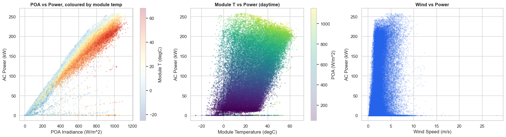
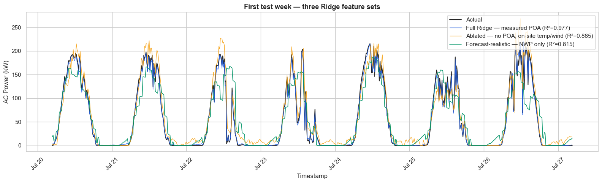

### Solar PV Production Forecasting

**Shawn Cunningham** — Layer 3 Development Inc.

#### Executive summary

This study addresses a **three-part research question** (full statement
in the Research Questions section below) using a Ridge-regression
baseline on four years of real 15-minute production from NREL (National
Renewable Energy Laboratory) PVDAQ (Photovoltaic Data Acquisition)
System 4902 (NIST Ground-1, Gaithersburg MD), paired with hourly
Open-Meteo / ERA5 (ECMWF Reanalysis v5) reanalysis weather as the
NWP-equivalent feature set for the deployment-realistic configuration.

**Part (a) — predictive accuracy.** Full Ridge nowcast with every
on-site sensor: R² (coefficient of determination) = 0.977, RMSE
(root-mean-squared error) = 9.6 kW. Deployment-realistic Ridge using
only NWP (Numerical Weather Prediction) inputs — no on-site
sensors at all: R² = 0.815, RMSE = 27.2 kW. The full configuration
clears the problem-statement target of R² ≥ 0.85; the deployment
configuration is just below it.

**Part (b) — feature ranking by ablation:** POA (plane-of-array)
irradiance (R² 0.977 → 0.885) > on-site temperature (0.885 → 0.815) >
solar geometry / cyclical time (always-available context) > on-site
wind ≈ NWP wind. Practical takeaway: a basic on-site weather station
materially outperforms NWP alone.

**Part (c) — vision-based replacement (extra credit, exploratory).**
The Part (b) ranking shows POA irradiance is the highest-value on-site
signal; the instrumentation that produces it (Kipp & Zonen CMP 21
thermopile pyranometer + CVF 3 ventilator + Si reference cells) runs
roughly **$6K–$7K per site**. Whether a fixed sky camera + cloud-tracking
model can recover enough of that signal to substitute for the
pyranometer is treated here as a research direction, not a result.

#### Rationale

The three-part research question is technically interesting because PV power has a strong
physical model — output ≈ irradiance × system efficiency × temperature
derating — but irradiance and temperature are themselves stochastic
outputs of weather. The empirical question is how much of that physical
structure a regularized linear model can recover, and how much skill
survives when on-site sensor measurements are unavailable at forecast
time.

This matters in practice because solar PV output varies — clouds,
temperature, wind, and seasonal sun-angle drift push instantaneous power
across a wide range. Forecast error has a non-linear cost:
under-forecasts can require grid purchases at peak prices; over-forecasts
waste battery capacity that could have absorbed the surplus. Any
shiftable downstream load benefits from knowing the upcoming production
profile.

Finally, the cost asymmetry behind question (c) is meaningful: a
research-grade pyranometer stack runs several thousand dollars per site,
while commodity sky cameras and edge compute do not. If a vision system
can recover most of the irradiance signal, deployment economics for
distributed PV change materially.

#### Research Questions

> *(a) Can supervised learning models accurately predict hourly solar PV
> power output from weather and temporal features, (b) which features
> matter most for forecast accuracy, and (c) [extra credit] can existing
> sensors used for measuring solar irradiance and power output be
> replaced with vision-based systems that measure cloud-cover density,
> speed, and direction?*

#### Data Sources

- **Primary — NREL PVDAQ System 4902** (NIST Ground-1, Gaithersburg MD).
  270.7 kW fixed ground-mount photovoltaic (PV) array, ~112,000 rows at
  15-min cadence, July 2014 → March 2018. Channels: AC / DC power,
  dual-redundant POA (plane-of-array) irradiance, ambient and module
  temperature, wind. Pre-cleaned wide-format parquet at
  `data/nist_ground_4902_15min.parquet`. Public, Creative Commons-licensed
  data via NREL PVDAQ on AWS S3.

  https://developer.nrel.gov/docs/solar/pvdaq-v3/

- **Secondary — Open-Meteo Historical** (ERA5 = ECMWF Reanalysis v5).
  Hourly cloud cover (total + low / mid / high), NWP-modeled GHI / DNI /
  DHI (global / direct-normal / diffuse horizontal irradiance), 2-m air
  temperature, 10-m wind speed, relative humidity, surface pressure.
  Cached at `data/openmeteo_nist_4902_hourly.parquet`. Used as the
  NWP-equivalent feature set in the deployment-realistic Ridge. Open-Meteo
  API data are offered under **CC BY 4.0**; attribution:
  [weather data by Open-Meteo.com](https://open-meteo.com/). This project
  caches the hourly data locally and forward-fills it onto the 15-min PVDAQ
  index.

  https://open-meteo.com/en/docs/historical-weather-api
  https://open-meteo.com/en/licence
  https://creativecommons.org/licenses/by/4.0/

#### Methodology

The notebook follows the **CRISP-DM** (Cross-Industry Standard Process for
Data Mining) process model:

1. **Data Understanding** — load both datasets; describe shape, dtypes, and
   summary statistics; sanity-check ranges and coverage.

2. **Data Preparation** — clean missing values (split-aware time
   interpolation), detect and clip physical-bound violations, average
   redundant sensor pairs, merge Open-Meteo onto the 15-min PVDAQ index by
   forward-fill.

3. **Feature engineering** — pvlib solar geometry (AOI, clear-sky POA,
   clear-sky index), cyclical time encodings (sin/cos of hour and
   day-of-year), calendar features, physics-driven interactions
   (POA × module-temperature, module − ambient delta).

4. **Modeling** — chronological 80/20 split with `StandardScaler` fit on
   training data only. We fit Ridge regression (α = 1) under three
   feature-availability scenarios so the ablation cleanly answers part (b)
   of the research question:
   - **Full Ridge** — every on-site sensor, including measured POA, at time *t*.
   - **Ablated Ridge** — drops the three POA-derived features but keeps
     on-site temperature and wind.
   - **Forecast-realistic Ridge** — drops every on-site PVDAQ measurement
     and substitutes the 11 Open-Meteo NWP-equivalent fields.

5. **Evaluation** — four metrics on the held-out chronological test set:
   | Metric | Units | Why this metric |
   |---|---|---|
   | **RMSE** (root-mean-squared error, primary) | kW | Penalizes large errors quadratically — non-linear forecast-error cost (see Rationale) means one 100-kW miss matters more than ten 10-kW misses. |
   | MAE (mean absolute error) | kW | Average miss in the same units as the target. |
   | R² (coefficient of determination) | — | Dataset-agnostic comparison across configurations. |
   | MAPE (mean absolute percentage error, daytime AC > 10 kW) | % | Stakeholder-friendly framing ("model is off by ~13 %"). Restricted to daytime to avoid divide-by-zero on the nighttime half of the dataset. |

   Coefficient interpretation and hour-of-day residual diagnostics
   accompany the headline numbers.

#### Results

| Configuration | RMSE (kW) | R² | Daytime MAPE | What it tells us |
|---|---:|---:|---:|---|
| Full Ridge (all on-site sensors, including POA) | **9.64** | **0.977** | 12.9 % | Variance ceiling for weather-only models |
| Ablated Ridge (no POA, on-site temp/wind retained) | 21.41 | 0.885 | 35.3 % | Cost of losing the pyranometer |
| Forecast-realistic Ridge (NWP-only) | 27.16 | 0.815 | 48.8 % | Cost of replacing every on-site sensor with NWP |

#### Key visuals


Daily AC power tracks measured POA across the year, and the AC / POA ratio
stays stable, supporting the physical model behind the feature set.



Measured POA is the dominant predictor of AC power; module temperature adds
a secondary thermal-derating signal.



Removing measured POA and then all on-site sensors shows the deployment cost:
R² falls from 0.977 to 0.885 to 0.815.

**Direct answer to the research question:**

- **(a) Yes, supervised learning predicts hourly PV power well.** The full
  Ridge explains 97.7 % of variance — linear regression alone recovers
  most of the structure, without resorting to non-linear models.
- **(b) Features ranked by importance:** POA irradiance (single most
  highest-impact) → on-site temperature (panel + ambient) → solar geometry
  and cyclical time (always-available context) → on-site wind ≈ NWP
  wind. POA × module-temperature interaction captures the thermal-derating
  signal Ridge would otherwise miss.
- **(c) Vision-based replacement remains a research direction.** The
  ablation identifies POA as the target signal a camera system would need
  to recover, but this initial submission does not include camera data or a
  cloud-tracking model.

**Methodological findings**

- **Separate nowcast and forecast feature sets.** Do not combine measured POA
  with NWP cloud cover in the same model. Measured POA already contains the
  realized cloud-attenuation signal; NWP cloud cover belongs in the
  forecast-realistic model where measured irradiance is unavailable.
- **Protect against target leakage.** The baseline excludes DC power and any
  lag/rolling features derived from AC power. Solar geometry and cyclical time
  features are deterministic from timestamp and site metadata, so they are
  available at prediction time.

**Limitations**

- Single-site model — cross-site generalization deferred to final submission (PVDAQ System
  1332, Golden CO + NSRDB hourly weather).
- Cloud-cover signal is ERA5 reanalysis, not a live forecast — an
  operational NWP would have lower skill, so the 0.815 number is an upper
  bound for true deployment.
- 15-min cadence — adequate for hourly forecasts, too coarse for
  real-time (1-min) microgrid control.
- Vision-based replacement (research question c) is scoped as future
  work; this submission does not include camera data or a cloud-tracking
  model.


#### Next steps

Building on the Ridge baseline answers, follow-on work targets the gap
between the full nowcast (R² 0.977) and the forecast-realistic deployment
lower bound (R² 0.815):

- Replace ERA5 reanalysis with operational NWP — NSRDB (National Solar
  Radiation Database) PSM4 (Physical Solar Model v4) or NOAA's HRRR
  (High-Resolution Rapid Refresh) — so the cloud cover represents
  *forecast skill*, not reanalysis truth.
- H-step forecasting at H = 1 h, 6 h, 24 h with expanding-window
  time-series cross-validation.
- Model comparison on the forecast-realistic feature set: SARIMAX (seasonal
  ARIMA with exogenous regressors), XGBoost (gradient-boosted trees) with
  SHAP (Shapley additive explanations) feature attribution, LSTM (long
  short-term memory recurrent network), and a Lasso baseline. Trees and LSTM
  may learn an internal thermal model
  from `om_temp_2m` + `om_ghi` + `om_wind_10m`, recovering the
  panel-temperature signal Ridge misses.
- Sandia thermal model — synthesize `module_temp_estimated` from NWP
  inputs to close the §9.1 → §9.2 R² gap left by the missing on-site
  module-temperature channel.
- Cross-site generalization test on PVDAQ System 1332 (Golden CO) paired
  with NSRDB hourly weather (no on-site sensors).
- Hyperparameter tuning via Bayesian optimization (Optuna).
- **Vision-based irradiance proxy (research question c).** Mount a fixed
  sky camera at the site, train a cloud-cover / cloud-motion model from
  the image stream, and benchmark it as a drop-in substitute for the
  pyranometer in the forecast-realistic Ridge. Targets the $6K–$7K-per-site
  instrumentation cost.

#### Outline of project

```
.
├── README.md                              ← this file
├── Solar_PV_Forecasting.ipynb             ← the analysis notebook
├── GLOSSARY.md                            ← plain-English vocabulary reference
├── requirements.txt                       ← pinned Python dependencies
├── figures/                               ← rendered notebook visuals used in README
│   ├── annual_seasonality_2017.png
│   ├── poa_vs_power_relationships.png
│   └── ridge_feature_set_comparison.png
└── data/
    ├── SOURCES.md                         ← source URLs, licensing, and dataset notes
    ├── POA_IRRADIANCE_MEASUREMENT.md      ← POA sensor and measurement details
    ├── POA_SENSOR_COSTS.md                ← irradiance sensor cost estimates
    ├── nist_ground_4902_15min.parquet     ← primary, 5.7 MB, 112,000 rows × 9 cols
    └── openmeteo_nist_4902_hourly.parquet ← secondary, 759 KB, 31,824 rows × 17 cols
```

- [Solar_PV_Forecasting.ipynb](Solar_PV_Forecasting.ipynb) — full
  CRISP-DM walkthrough: data understanding, cleaning, EDA (exploratory
  data analysis), feature engineering, three-tier Ridge baseline,
  evaluation, conclusions.
- [GLOSSARY.md](GLOSSARY.md) — plain-English reference for the technical
  vocabulary used throughout the notebook (POA, AOI, NWP, ERA5, clear-sky
  index, Ridge, RMSE / R² / MAPE, etc.).
- [requirements.txt](requirements.txt) — pinned Python package versions
  used in the notebook (pandas, numpy, scikit-learn, pvlib, openmeteo,
  matplotlib, seaborn, xarray). Run `pip install -r requirements.txt` to
  recreate the environment.
- **`figures/`** — exported notebook visuals embedded in this README:
  annual seasonality, POA/power relationships, and three-way Ridge feature
  set comparison.
- **`data/`** — input data files and supporting source notes:
  - `data/SOURCES.md`: canonical dataset/source URLs, licensing notes, and
    local file references for NREL PVDAQ and Open-Meteo.
  - `data/POA_IRRADIANCE_MEASUREMENT.md`: explanation of how
    `poa_irradiance_wm2` is measured at NIST Ground-1 and why the sensor
    redundancy matters for modeling.
  - `data/POA_SENSOR_COSTS.md`: rough order-of-magnitude cost estimates for
    the POA irradiance instrumentation discussed in research question (c).
  - `data/nist_ground_4902_15min.parquet` (5.7 MB): NREL PVDAQ 15-min
    AC / DC power, POA irradiance, on-site temperature sensors, wind,
    humidity (July 2014 → March 2018, 112,000 rows × 9 cols).
  - `data/openmeteo_nist_4902_hourly.parquet` (759 KB): 31,824 rows ×
    17 cols of ERA5 reanalysis features (hourly) matched to the NREL index.
  Both are pre-cleaned and ready to use.

**Reproducing**

```bash
# From this directory:
python -m venv .venv
source .venv/bin/activate
pip install -r requirements.txt

jupyter nbconvert --to notebook --execute --inplace Solar_PV_Forecasting.ipynb
# or open Solar_PV_Forecasting.ipynb in JupyterLab and Run All.
```

The notebook resolves data paths relative to its own directory, so it runs
end-to-end as long as the `data/` subdirectory sits alongside it.

##### Contact and Further Information

Shawn Cunningham — Layer 3 Development Inc.
shawn@layer3dev.com
